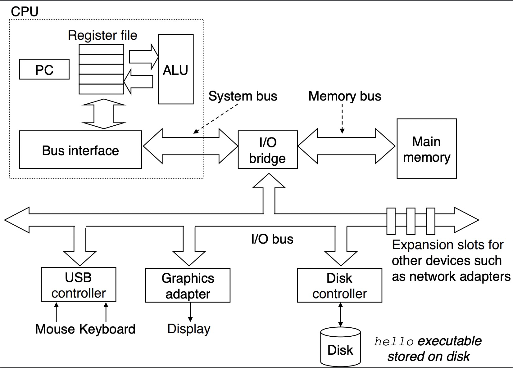
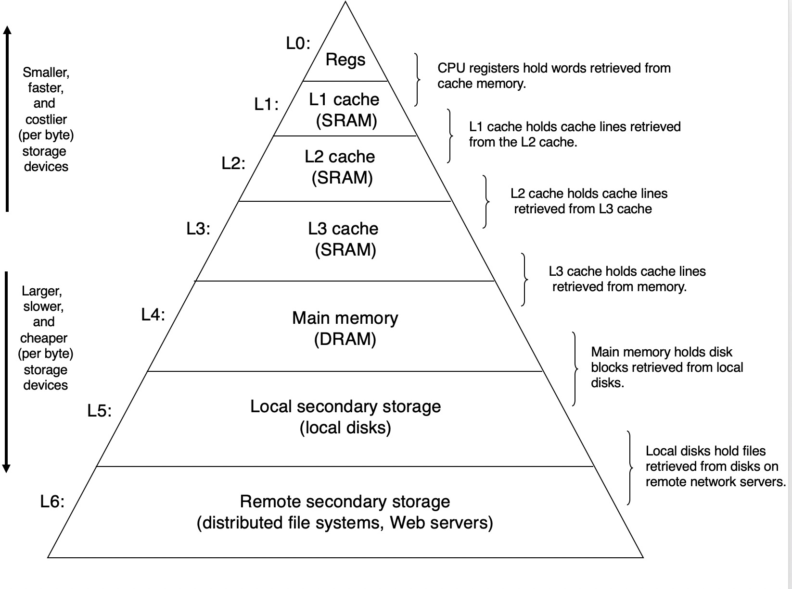

### 系统的硬件组成

#### 总线

总线携带信息字节并负责在各个部件间传递。通常总线被设计成传送定长的字节块，也就是字（word）。字中的字节数（字长）是一个基本的系统参数。现在的大多数机器字长要么是4个字节要么是八个字节

#### IO设备

IO设备是系统与外部世界的联系通道。每个IO设备都通过一个控制器或适配器与IO总线相连

#### 主存

主存是一个临时存储设备，在处理器执行程序时，用那个来存放程序和程序处理的数据。从物理上来说，主存是由一组动态随机存取存储器（DRAM）芯片组成的。从逻辑上说，存储器是一个线性的字节数组，每个字节都有其唯一的地址

#### 处理器

即中央处理单元，CPU，是解释或执行存储在主存中指令的引擎。处理器的核心是一个大小为一个字的存储设备（或寄存器），称为程序计数器（PC）。在任何时刻，PC都指向主存中的某条机器语言指令。

CPU在指令的要求下可能会执行这些操作：

* 加载。从主存复制一个字节或者一个字到寄存器，以覆盖寄存器原来的内容

* 存储。从寄存器复制一个字或者一个字节到主存

* 操作。把两个寄存器的内容复制到ALU，ALU对这两个字做算术运算，并将结果放到一个寄存器中，以覆盖原来的内容

* 跳转。从指令本身中抽取一个字，并将这个字复制到程序计数器中，以覆盖PC中原来的值

  

### 存储设备的层次结构

